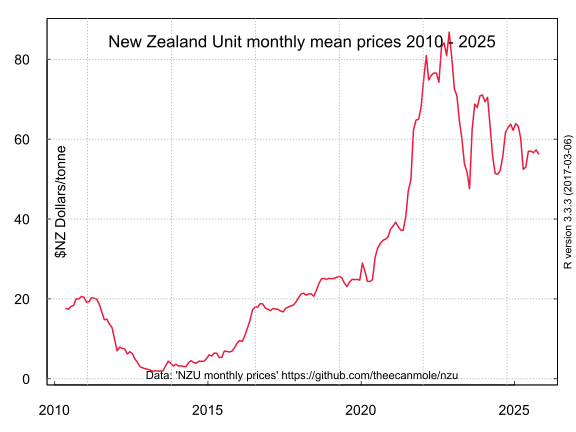
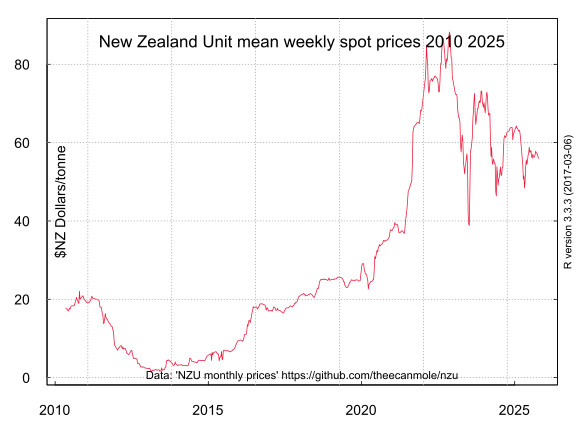
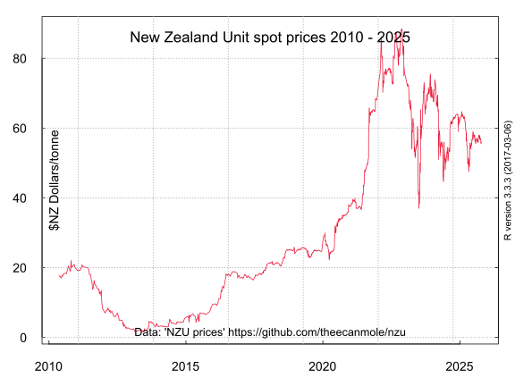
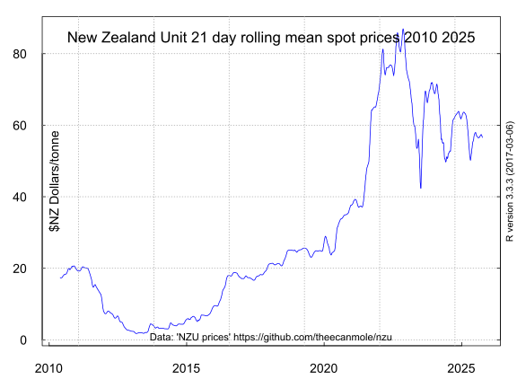

## New Zealand Emission Unit Prices in the NZ Emissions Trading Scheme 2010 to date. 

### Description

This repository provides several examples of data series of trading prices for the New Zealand emission unit (or "NZU"), the domestic emission unit in the [New Zealand emissions trading scheme](https://en.wikipedia.org/wiki/New_Zealand_Emissions_Trading_Scheme/ "New Zealand emissions trading scheme").      

* The manually web-scraped edited price data: [nzu-edited-raw-prices-data.csv](nzu-edited-raw-prices-data.csv).

* The mean monthly price data: [nzu-month-price.csv](nzu-month-price.csv).

* The mean weekly price data with missing values infilled by linear interpolation: [weeklymeanprice.csv](weeklymeanprice.csv).

* The spot prices with the missing values infilled by linear interpolation: [spotpricesinfilled.csv](spotpricesinfilled.csv)

* The 21 day rolling mean of the spot prices with the missing values infilled by linear interpolation: [spotrollmean31.csv](spotrollmean31.csv)

### Charts

 

There is a chart of the monthly data at [Wikimedia Commons](https://commons.wikimedia.org/wiki/File:NZU-NZ-emission-unit-720by540.svg).

### Data Preparation

#### Requirements

Data preparation was performed with the [R programming language](https://www.r-project.org/about.html), R version 4.4.2 (2024-10-31) with the [RKWard 0.7.5 IDE](https://rkward.kde.org/) running on an i586-pc-linux-gnu (64-bit), [Debian GNU/Linux 12 (Bookworm) MX-21](https://mxlinux.org/index.php) operating system on a HP Probook 450 G4 laptop.

#### Processing

The price data has been either webscraped manually or web-scraped by a Python script 'api.py' (which was kindly contributed by [Edi Rose](https://github.com/edi-rose/)).

It is recorded in the file [nzu-edited-raw-prices-data](https://github.com/theecanmole/nzu/raw/master/nzu-edited-raw-prices-data). 

The commands in the R script 
[NZU-monthly-mean.r](https://github.com/theecanmole/nzu/blob/master/NZU-monthly-mean.r) process the raw data into a mean monthly time series, a mean weekly time series and an daily infilled time series of secondary market spot prices. These dataframes are then written to .csv files.

### License

#### ODC-PDDL-1.0

This data package and these datasets and the R scripts are made available under the Public Domain Dedication and License v1.0 whose full text can be found at: http://www.opendatacommons.org/licenses/pddl/1.0/. You are free to share, to copy, distribute and use the data, to create or produce works from the data and to adapt, modify, transform and build upon the data, without restriction.

#### Index of files

1. [NZU-monthly-mean.r](https://github.com/theecanmole/nzu/blob/master/NZU-monthly-mean.r) (R script file of code to process raw price data to monthly mean price)

2. [nzu-edited-raw-prices-data.csv](https://github.com/theecanmole/nzu/raw/master/nzu-edited-raw-prices-data.csv) (price data, irregular dates, with week and month factor columns, prices and url references)

3. [spotprices.csv](https://github.com/theecanmole/nzu/raw/master/spotprices.csv) (spot prices data, irregular dates and prices)

4. [spotpricesinfilled.csv](https://github.com/theecanmole/nzu/raw/master/spotpricesinfilled.csv) (infilled spot prices by business day)

5. [nzu-month-price.csv](https://github.com/theecanmole/nzu/raw/master/nzu-month-price.csv) (the monthly means of the spot price data)

6. [weeklymeanprice.csv](https://github.com/theecanmole/nzu/raw/master/weeklymeanprice.csv) (the weekly means of the spot price data with 95 missing values)

7. [weeklypricefilled.csv](https://github.com/theecanmole/nzu/raw/master/weeklypricefilled.csv) (the weekly means of the spot price data with the missing values infilled via linear interpolation)

8. [NZU-charts.r](https://github.com/theecanmole/nzu/blob/master/NZU-charts.r) (R script file of code to create [charts](https://commons.wikimedia.org/wiki/File:NZU-NZ-emission-unit-720by540.svg))

9. [Licence.txt](https://github.com/theecanmole/nzu/blob/master/Licence.txt) (Public Domain  Dedication and License v1.0 http://opendatacommons.org/licenses/pddl/1.0/)

#### Citation

Theecanmole. (2016). New Zealand emission unit (NZU) monthly prices 2010 to 2016: V1.0.01 [Data set]. Zenodo. http://doi.org/10.5281/zenodo.221328 
